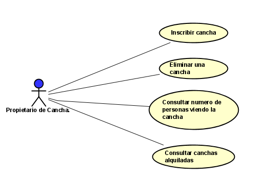
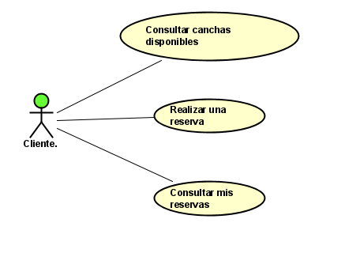
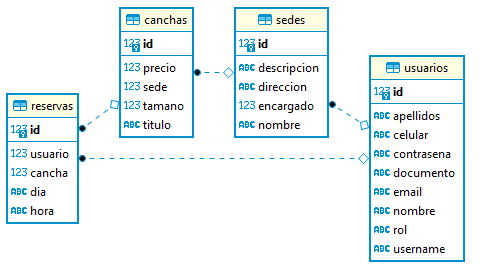
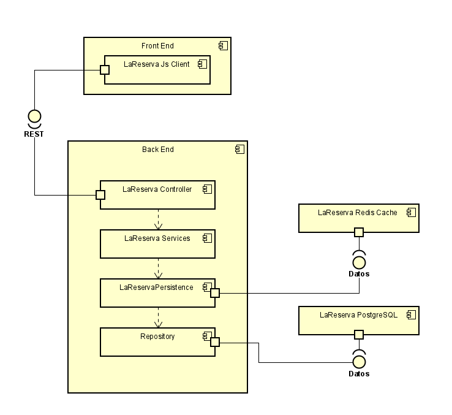
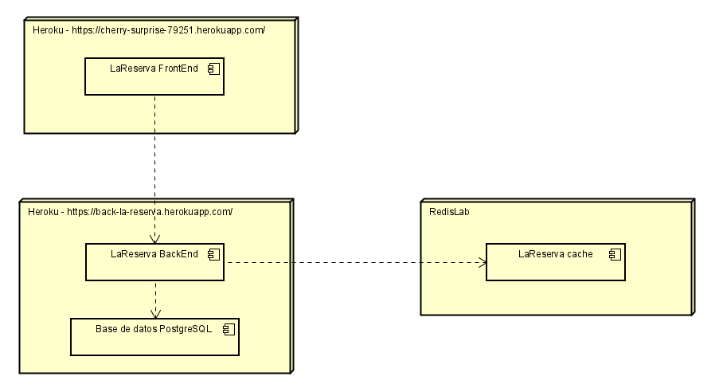

 
  

 
# La Reserva

## Desarrollado por
-   Federico Barrios Meneses
-   Brayan Steven Burgos Delgado
-   Andrés Jose Gutiérrez Marín	
-   Jonathan Fabian Páez Torres

### Heroku

### CircleCi

### Codacy

## Resumen  
Es una aplicación que permite a los usuarios alquilar canchas de fútbol por fecha y hora en tiempo real, así como se puede usar la aplicación para alquilar
canchas de fútbol, también se puede usar para ofrecer las canchas de fútbol. De igual manera en la aplicación hay otros serivicios adicionales que no tienen
relevancia en la funcionalidad principal del sistema, como el servicio de contraseñas olvidadas, tiempo real, entre otros.

## Descripción  
La idea de esta aplicación nace de la experiencia propia con los sitios que prestan este tipo de servicios como lo son la renta de canchas de fútbol, normalmente estos 
lugares que ofrecen sus canchas de fútbol lo hacen por medio de redes sociales, como facebook, whatsapp, instagram, entre otros, por lo cual en ocasiones se pueden cometer
errores con las reservas de los usuarios que contactan para alquilar este tipo de servicios, por otro lado, hace más difícil al usuario interesado en alquilar una cancha de
fútbol encontrar la cancha que considere apropiada por precio y calidad, esto implica que las personas deben conocer el lugar y la página donde pueden realizar sus reservas.

Como equipo proponemos esta aplicación con el fin de facilitar esa búsqueda del servicio de estos usuarios y evitar los errores que se pueden cometer por realizar este tipo de
reservas por medio de redes sociales, además se propone una interfaz sencilla fácil de usar y con toda la información necesaria para los usuarios que hagan uso de esta. Es un hecho
que al facilitar la consulta de estos servicios en una sola aplicación implica que los usuarios no tienen que conocer necesariamente los lugares para saber si es lo que están buscando
los usuarios que ofrezcan estos servicios en la aplicación propuesta tienen una gran ventaja y es que están vendiendo en un gran mercado virtual o marketplace, lo cual asegura que 
una gran cantidad de usuarios que hagan uso de esta aplicación van a poder conocer sus ofertas y de esta manera ganar popularidad y llegar a sus clientes de una manera mucho más
sencilla.

Además de ser una gran idea para mejorar las ventas de estos negocios y facilitar las consultas a los usuarios que consumen estos servicios, es una aplicación segura, que se preocupa
por conservar la confidencialidad, integridad y disponibilidad de los datos que transitan en la aplicación, obteniendo de esta manera la confianza en todos los usuarios que quieran
hacer uso de la aplicación.

### Diagramas de casos de uso

Se realizó un Diagrama de Casos de Uso con las funcionalidades más destacadas del funcionamiento previsto:

#### Propietario

-   COMO propietario QUIERO ofertar e inscribir mis canchas en el sitio PARA PODER tener más visibilidad de mi producto y aumentar las ganancias de mi empresa.
-   COMO propietario QUIERO eliminar mis canchas del sitio PARA PODER tener mi catálogo actualizado y que la información tenga credibilidad.
-   COMO Propietario QUIERO ver el numero de personas viendo actualmente una cancha PARA PODER saber o conocer las preferencias de las personas.

#### Cliente

-   COMO usuario QUIERO consultar las canchas disponibles PARA PODER tomar una desición de alquilar una cancha en el sitio.
-   COMO usuario QUIERO realizar una reserva PARA PODER apartar la cancha que quiero.
-   COMO usuario QUIERO Consultar mis reservas PARA PODER verificar el estado de mis reservas y que se hayan realizado exitosamente.

### Modelo entidad relación de la base de datos

### Diagrama de componentes

### Diagrama de despliegue

## Atributos no funcionales
Estos atributos son los que delimitarán las características generales, restricciones y limitaciones de nuestra aplicación.

### Seguridad

Escenario 1: Cifrar contraseñas.
-   Fuente: Usuario final.
-   Objetivo: Crear un usuario en la aplicación.
-   Infraestructura: Frontend, Backend, Base de datos.
-   Ambiente: Aplicación bajo condiciones normales.
-   Resultado esperado: Las contraseñas deben estar cifradas.
-   Medición: Las contraseñas del usuario y propietarios se cifran con Sha256.

https://youtu.be/wnURyXOhss4

### Usabilidad

Escenario 1: Publicar sedes.
-   Fuente: Usuario final.
-   Objetivo: Publicar una sede en la aplicación.
-   Infraestructura: Frontend, Backend, Base de datos.
-   Ambiente: Aplicación bajo condiciones normales.
-   Resultado esperado: La publicación se realiza y se puede visualizar de manera exitosa.
-   Medición: El propietario es capáz de publiar una sede desde la página principal de manera exitosa.

https://www.youtube.com/watch?v=0nfbvoe5jHI

Escenario 2: Reservar Canchas.
-   Fuente: Usuario final.
-   Objetivo: El cliente puede reservar exitosamente una cancha.
-   Infraestructura: Frontend, Backend, Base de datos.
-   Ambiente: Aplicación bajo condiciones normales.
-   Resultado esperado: Aparece una notificación en pantalla confirmando la reserva, ademas de un correo electronico de confirmación.
-   Medición: El cliente puede hacer una reserva con los items que seleccione y en caso de no estar disponible, que se le notifique.

https://www.youtube.com/watch?v=vKAgwXdbHBw

### Escalabilidad

Escenario 1: Escalabilidad vertical.
-   Fuente: Usuarios finales.
-   Objetivo: Sobrecargar la cantidad de usuarios finales.
-   Infraestructura: Azure.
-   Ambiente: Aplicación bajo estrés.
-   Resultado esperado: El dyno escala verticalmente según la sobrecarga de usuarios.
-   Medición: El tiempo de respuesta de cada usuario no aumenta, sigue siendo aproximadamente de un segundo.

Escenario 2: Escalabilidad horizontal.
-   Fuente: Usuarios finales.
-   Objetivo: Sobrecargar la cantidad de usuarios finales.
-   Infraestructura: Azure.
-   Ambiente: Aplicación bajo estrés.
-   Resultado esperado: Se escala horizontalmente según la sobrecarga de usuarios implementando otros dynos.
-   Medición: El tiempo de respuesta de cada usuario no aumenta, sigue siendo aproximadamente de un segundo.

### Rendimiento

Escenario 1: Reservar concurrentemente.
-   Fuente: Usuario final.
-   Objetivo: Más de un usuario reserva por la misma cancha al mismo tiempo.
-   Infraestructura: Frontend, Backend, caché, Base de datos.
-   Ambiente: Aplicación bajo condiciones normales.
-   Resultado esperado: Solo una persona se queda con la reserva y todas las demás son notificadas de que esa cancha, no esta disponible.
-   Medición: Se informa al cliente que reservo con exito y a todos los demas se les notifica que esa reserva ya no esta  disponible, cuando intenta reservar.

Escenario 2: Conexión a socket cuando se ve una publicación. 
-   Fuente: Usuario final.
-   Objetivo: Conocer cuantas personas estan viendo una publicacion al mismo tiempo.
-   Infraestructura: Frontend, Backend, Base de datos.
-   Ambiente: Aplicación bajo condiciones normales.
-   Resultado esperado: Todos los cliente reciben información de cuantas personas estan viendo la misma publicación al mismo tiempo.
-   Medición: Observar el numero de personas que actualmente se encuentran en esa cancha. 

### Disponibilidad

Escenario 1: Indisponibilidad máxima.
-   Fuente: Usuario final.
-   Objetivo: Verificar ante un ataque DOS la disponibilidad del sistema.
-   Infraestructura: Frontend, Backend.
-   Ambiente: Aplicación bajo peticiones automatizadas.
-   Resultado esperado: Se carga correctamente la aplicación.
-   Medición: La aplicación está disponible y carga correctamente.

https://www.youtube.com/watch?v=CIiBFYCsFaI

Escenario 2: Ingresar correctamente a la página bajo estrés.
-   Fuente: Usuario final.
-   Objetivo: Ingresar a la aplicación para poder obsrvar su funcionamiento.
-   Infraestructura: Frontend, Backend, Base de datos.
-   Ambiente: Aplicación bajo condiciones de estrés.
-   Resultado esperado: La aplicación funciona con normalidad.
-   Medición: Las canchas y su informacion correspondiente siguen cargándose en un promedio de 1 segundo.

https://www.youtube.com/watch?v=8xam_58aX6U
